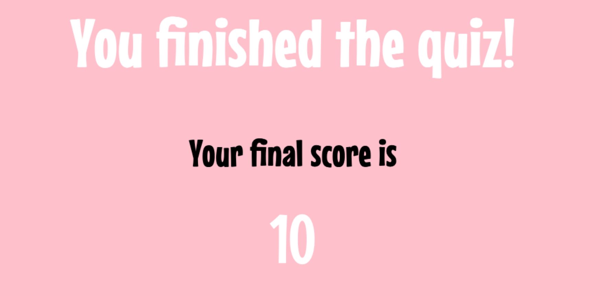

# Disney Quiz

A Disney quiz designed to test players' knowledge of Disney movies and characters. The quiz will have a user-friendly interface with a Disney-themed design, incorporating iconic Disney characters, logos, or imagery to create an engaging atmosphere for the players. The quiz will cover various aspects of Disney, including:
        Characters: Identifying characters based on descriptions or images.
        Movies: Questions about plots, songs, or memorable scenes from Disney movies.
The quiz could consist of multiple-choice questions.

View the live website [here][https://aslikaradas.github.io/disneyquiz/]

## Features

### Welcome page

* Logo and Welcome
    * The site opens up to the welcome page, presenting the viewer with the quiz's logo and a warm welcome.
    * This gives the user a natural feeling starting point to set off from.

* Play button and How-to-Play
    * Under the welcoming message lies an enticement to engage, accompanied by a prominent "Play" button that initiates the gameplay. Beneath this button, concise guidelines await, offering instructions on how to participate.
    * The play invitation seamlessly integrates into the gaming experience, requiring players to click the "Play" button at their convenience. This straightforward approach serves as an effective gateway, leading them to the game page when they're prepared to begin.
    * The instructions provided below offer guidance on gameplay mechanics and outline what players can anticipate as they progress through the game. 

### Quiz page

* HUD and Question display
    * At the top section of the games page, prominently displayed, is a Heads Up Display (HUD). Directly below, players encounter the current quiz question as the focal point of the screen.
    * The HUD serves as a vital information panel for players, presenting key details. The number on the left denotes the current question among the 10 in the quiz, while the number on the right showcases their ongoing score. This information is crucial for players to track their progress and strive for improved scores upon replaying the quiz. 

* Option Buttons
    * Players are provided with three answer options for each question, with only one being the correct answer. Upon selection, the accuracy of their choice is indicated by the option turning either green or red, aligning with the instructions highlighted in the "How To Play" section on the home page.
    * The visual cue of color change effectively communicates to players. Red commonly signifies "wrong" or "stop," while green universally represents "good" or "go." This intuitive color scheme ensures that all players can easily identify and understand the significance of the color they encounter during gameplay.

### End page

* Final Score
    * As the quiz concludes, players receive a notification indicating that they've reached the end, followed by the presentation of their final score.
    * Upon completion, users are provided with a numerical representation of their performance, displayed as their final score.

* Replay or Go Home buttons
    * Below their final score the player is prompted to either replay or to leave and go to the home page.
    * This end page gives the player the option of a natural end the quiz or to play again for a better score. 

## Testing

* The site was tested repeatedly as it was developed. I used the google chrome developer tools console heavily through out to log values as I worked through the site and view any error codes that came up as the site was being developed.

* I have tested the webpage on a number of different mobile devices available on the google chrome developer tools to make sure they where responsive.
    * iPhone 13 Pro
    * iPhone 12 Pro
    * Pixel 5
    * iPhone 8 Plus
    * MacBook Pro 13"
    * Samsung Galaxy S20 Ultra
    * iPad Air
    * iPad Mini
    * Surface Pro 7
    * Samsung Galaxy A51/71

## Validator Testing
* HTML
    * No errors were returned when passing through the official [W3C validator](https://validator.w3.org/nu/)
* CSS
    * No errors were found when passing through the official [(Jigsaw) validator](https://jigsaw.w3.org/css-validator/)
* JavaScript
    * No errors were found when passing through the official [Jshint validator](https://jshint.com/)
    * The following metrics were returned:
        * There are 5 functions in this file.
        * Function with the largest signature take 0 arguments, while the median is 0.
        * Largest function has 12 statements in it, while the median is 6.
        * The most complex function has a cyclomatic complexity value of 3 while the median is 1.

## Deployment
* The site was deployed to GitHub pages. The steps to deploy are as follows:
    * In the GitHub repository, navigate to the Settings tab
    * From the source section drop-down menu, select the Master Branch
    * Once the master branch has been selected, the page will be automatically refreshed with a detailed ribbon display to indicate the successful deployment.
The live link can be found here - [https://aslikaradas.github.io/disneyquiz/](https://aslikaradas.github.io/disneyquiz/)

## Credits

* Questions for the quiz sourced from [mantelligence](https://www.mantelligence.com/video-game-trivia/)
* Learned to used the setTimeout for timing execution of some of my functions on [w3schools](https://www.w3schools.com/js/js_timing.asp)
